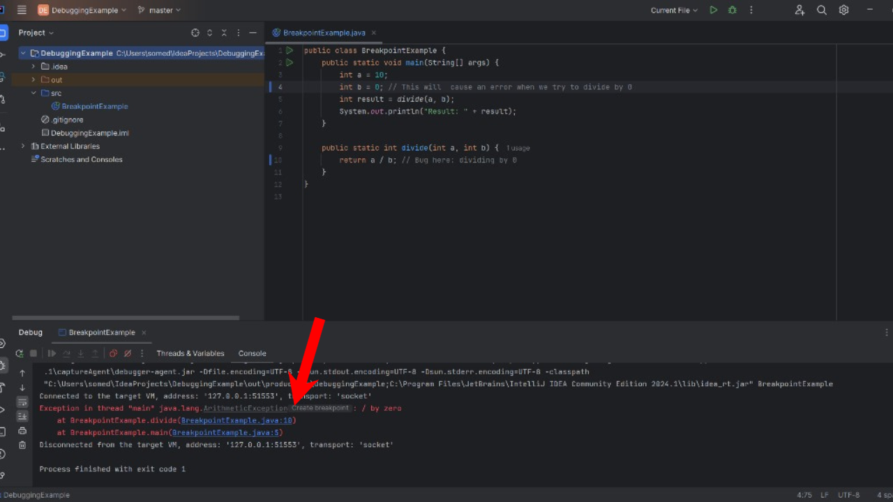
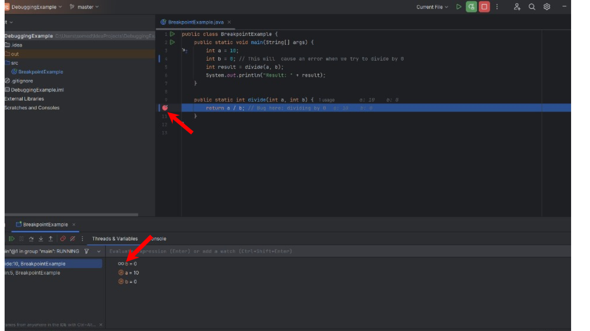
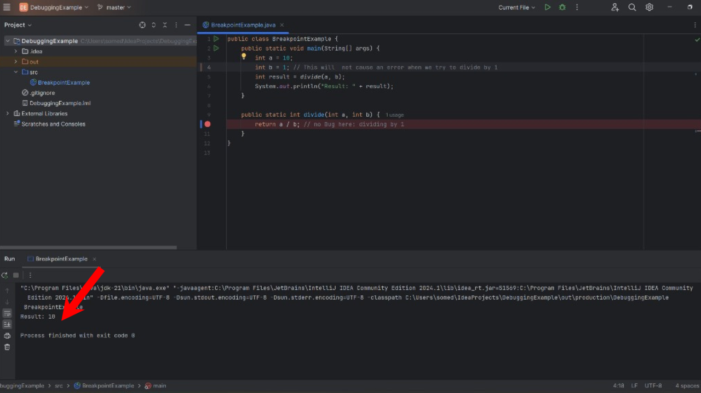

## Understanding and Using Breakpoints

### What is a Breakpoint?

A **breakpoint** is a tool used in debugging that allows you to pause the execution of your program at a specific line of code. This pause lets you inspect the current state of your program, including variable values and the flow of execution, which can help you identify and fix bugs.

### Before Using Breakpoints

Before we use breakpoints, we encounter a problem where the code fails due to an error. In the example below, the code throws an error because it attempts to divide by zero:

In this scenario, the program crashes, and we do not have any insight into why the error occurred.

### Setting and Using Breakpoints

To debug effectively, we set a breakpoint in the code to pause execution and inspect its state. Here’s how we use breakpoints:

1. **Set a Breakpoint:**
   - Open the code in your IDE.
   - Click in the left margin next to the line number where you want to set the breakpoint. A red dot will appear, indicating the breakpoint.

   

2. **Run in Debug Mode:**
   - Click the debug icon or go to `Run > Debug` from the menu.
   - The program will run and pause execution at the breakpoint.

3. **Inspect Variables and State:**
   - When the program pauses, you can inspect the variable values in the "Variables" tab in the debug window.
   - You can step through the code line by line using the debugging controls to see how the program's state changes.

4. **Continue Execution:**
   - After inspecting, you can continue running the program by clicking the resume button or stepping through the code further.

### After Using Breakpoints

After applying breakpoints and inspecting the state, we identify the issue and fix the code. The corrected code is then executed successfully:

By using breakpoints, we gain valuable insights into the program’s behavior and can correct issues effectively.
